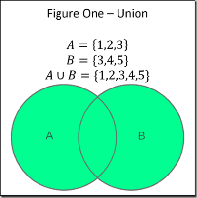

# Combining Arrays
Write a function that takes two arrays as arguments,
and returns an array containing the union of the values
from the two.

There should be no duplication of values in the returned
array, even if there are duplicates in the original arrays.

You may assume that both arguments will always be arrays.


## 1. Problem
Given two arrays of elements (any data type), return a single
array with only unique elements.

### Input/s
1. array of elements 1
2. array of elements 2

### Output/s
1. array of unique elements


### Rules/Requirements
#### Explicit
1. The function takes two arrays as arguments
2. The function returns an array containing the union of the values from the two.
3. There should be no duplication of values in the returned array.
4. There should be no duplication of values even if there are duplicates in the original array.
5. Both arguments will always be arrays

#### Implicit
1. Elements can be any data type
2.
3.

### Edge Cases
- N/A


### Clarify questions
1. Should the function work for all data types (including arrays and objects), or just primitive types?
   - For now just make sure it works for primitive types.
   - Figure out how to compare Arrays and Objects.
2. What should we do if the one array is empty?
3. What should we do if both arrays are empty?


### Problem Domain
- [Set Theory](https://en.wikipedia.org/wiki/Set_theory)

Union of the sets `A and B`, denoted `A ∪ B`, is the set of all objects that are a member of `A`, or `B`, or both. For example, the union of `{1, 2, 3}` and `{2, 3, 4}` is the set `{1, 2, 3, 4}`.


### Diagram (Optional)
- Helps you understand the problem.



### Mental Model
Merge both collections of elements. Then, iterate through the list of elements and check if the current element is included in a result list. If the element is not then push it into the result list. Finally return the result list.


## 2. Examples/Test Cases
- Validate Understanding of the Problem
e.g. Given an array of numbers, return only the even number

`union([1, 3, 5], [3, 6, 9])` --> `[1, 3, 5, 6, 9]`
`union(['a', 'b', 'c'], ['c', 'd', 'a'])` --> `['a', 'b', 'c', 'd']`
`union(['a', 8, true], ['a', false, 8])` --> `['a', 8, true, false]`


---
## 3. Data Structure
- How we'll represent data that we'll work with when converting the input to output

#### Potential Data Structures
1. Using a javaScript [set](https://developer.mozilla.org/en-US/docs/Web/JavaScript/Reference/Global_Objects/Set)
2. Using an array
3. Using an Object (count elements + set as keys)


#### Selected Data Structure
- Array

---
## 4. Algorithm
#### Potential Algorithm Ideas
1. Flattened Array + `Array.includes()` function
2. JavaScript `Sets`.
3. Use an Object to count different elements, and then just return the keys (`Object.keys()`)?


#### Selected Algorithm
- See `Potential Algorithm Ideas # 1`

#### Pseudocode
```
1. Create a function called `union()` with two parameters `listA`, and `listB`.
2. Set a called `flattenedArray` to the result of flattening the input arrays.
4. Create an empty array called `unionArray`
5. iterate through flattened array
   1. if the current item is `included` in the unionArray
      push the current item into the `unionArray`
6. Return the `unionArray`
```

#### Formal pseudocode

```js
Given two collections of primitive elements

FUNCTION union(arrayA, arrayB)
  SET flattenedArray = SUBPROCESS "Turn arrayA and arrayB into a single array"
  SET unionArray = []

  FOREACH element in the collection `flattenedArray`
    IF element is NOT `included` in unionArray
      unionArray.push(element)
    ENDIF
  ENDFOREACH

  RETURN unionArray

FUNCTIONEND
```

---
## 5. Code
- Implement the algorithm with code


#### Refactor


#### Further Exploration